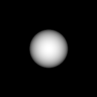
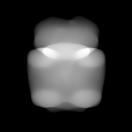
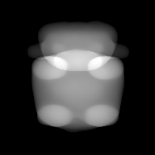
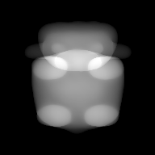
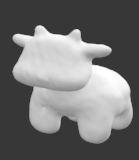

# ShapeFromProjections

This repository provides the official code for the preprint [Shape from Projections via Differentiable Forward Projector](http://arxiv.org/abs/2006.16120). The method estimates 3D shapes represented by a triangular mesh, directly from tomographic projection data. The basic idea of the method is to view tomographic reconstruction as a rendering process and extend a differentiable rasterizer [2] to optimize 3D shapes. Some parts of codes are ported from [2] with the comments of copyright form.

## Install

### Install requirements

The code requires python3 and [Pytorch](https://pytorch.org) using CUDA on Linux. Install other requirements:

```
pip install trimesh
pip install pymeshfix
pip install h5py
pip install toml
```

If you have a problem on `pymeshfix`, try to install a recent version of numpy (e.g., `pip install numpy==1.16.1`).

(Optional) To refine the mesh, `ctdr` requires another package for obtaining watertight. Compile the [watertight manifold code](https://github.com/hjwdzh/Manifold) and copy the running file `manifold` into `run` folder.

### Install ctdr package

```
cd $ROOT # go to the root folder of the repository
pip install -e .

# compile cuda files
cd ctdr/cuda
python build.py build_ext --inplace
```

## Usage

To run the code, go to `run` folder and type:

```
python ours.py -data 2starA -wedge 0 -wflat 0
```

where we set the regularization parameter for edge and flatting as 0. The default regularization parameter for Laplacian term is 10.0. You can see available data files in `data` folder. You just need to input the directory name after `-data`. You can see all the parameters by typing `python ours.py --help`. For example, if you want to impose Gaussian noise with relative level 0.3, then run `python ours.py -data 2spotA -eta 0.3`.

If you want to refine the mesh, as explained in the paper, you can run:

```
python ours.py -data 2bob02A -niter0 60
```

then, the method will refine the mesh at iteration 60, 120, 180. After finished, the results will be saved on `result` folder, including estimated projections, residuals and mesh files.

To run your own data, make a new folder in `data` and upload geometry information as `proj_geom.toml` and projection data file as `sinogram.npy` with the size of [angles x height x width]. You can refer to examples.

## Demo for 2spotA data

Example of estimated projection images at iteration 0, 60, 120, 180






and the final estimated mesh from noisy input:



## Reference

- [1] Huang, Jingwei, Hao Su, and Leonidas Guibas. Robust Watertight Manifold Surface Generation Method for ShapeNet Models., arXiv preprint arXiv:1802.01698 (2018).
- [2] Chen et al. Learning to Predict 3D Objects with an  Interpolation-based Differentiable Renderer. NeurIPS, 2019. https://nv-tlabs.github.io/DIB-R/

## Acknowledgement

This was funded by EU Horizon 2020 MSCA Innovative Training Network [MUMMERING](https://www.mummering.eu) Grant Number 765604.
